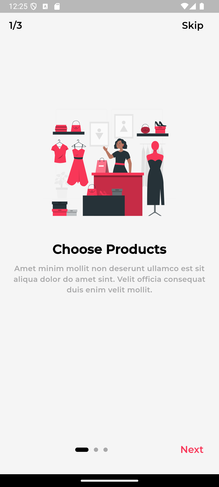

# e_commerce_app_aast

```markdown
# e_commerce_app_aast

## Overview
e_commerce_app_aast is a Flutter-based e-commerce application. This project demonstrates the use of various Flutter widgets and packages to create a seamless shopping experience.

## Features
- Onboarding screens
- Product selection
- Payment processing
- Order tracking

## Technologies Used
- Dart
- Flutter

## Getting Started

### Prerequisites
- Flutter SDK
- Dart SDK
- Android Studio
- An emulator or a physical device

### Installation
1. Clone the repository:
   ```sh
   git clone https://github.com/eng-marwa/e_commerce_app_aast.git
   ```
2. Navigate to the project directory:
   ```sh
   cd e_commerce_app_aast
   ```
3. Install dependencies:
   ```sh
   flutter pub get
   ```

### Running the App
1. Open the project in Android Studio.
2. Connect an emulator or a physical device.
3. Run the app:
   ```sh
   flutter run
   ```

## Project Structure
- `lib/`: Contains the main source code for the application.
    - `resources/`: Contains resource files such as colors, images, and styles.
    - `ui/`: Contains the UI components of the application.
    - `model/`: Contains data models used in the application.


## Screenshots

## Contributing
Contributions are welcome! Please fork the repository and create a pull request with your changes.

## License
This project is licensed under the MIT License.
```